# Bike Sharing Demand Kernel

To view the report in standalone page, follow the link here:

[Report](https://github.com/siyuanligit/Academic-Project-404/blob/master/Bike%20Share%20Rental%20Analysis%20Report%20Siyuan%20Li.md)

---

### Bike Share Rental Analysis

**Siyuan Li**

***

#### 1 Introduction

Ride sharing companies like Uber and Lyft are great business models that provide convenient, affordable and efficient transportation options for customers who want to go to places without the hassle of owning or operating a vehicle. However, with the increasing number of automobiles, riding sharing in cars are not efficient enough especially in crowded and busy areas like cities' downtown. Therefore, bike sharing is a brilliant idea which provides people with another short range transportation option that allows them to travel without worrying about being stuck in traffic and maybe enjoy city view or even workout at the same. In fact, bike sharing programs in the United States started about 15 years before Uber's ride share program started. 

In this project, I will be investigating into the bike share rental data from "Capital Bikeshare" servicing Washington D.C. and surrounding areas beginning 2010. Capital Bikeshare was the largest bike sharing service in the United States when they started, until Citi Bike for New York City started operations in 2013. Capital Bikeshare started from 10 stations and 120 bicycles in Washington D.C. and expanding into a bike share system that owns more than 429 stations and 2500 bicycles and also services Arlington County, Fairfax County, City of Alexandria in Virginia and Montgomery County in Maryland. 

My objective of the analysis is to find out the determining factor that drives the demand on bike share rentals, construct statistical models and then try to make prediction on rentals based on the information and models I have. My exploration and the analysis of the data will be performed in R, with a few functions written in C, as per requested.


#### 2 About the Data

The data I will be look into is downloaded and extracted from [Kaggle](https://www.kaggle.com/c/bike-sharing-demand/data). This bike share rental data of Capital Bikeshare only contains entries sampled from Washington D.C. spanning two years dating from January 1st, 2011 to December 19th, 2012. The dataset is also joined by the weather statistics for the corresponding date and time.

Due to being a competition dataset, complete data was divided into training set, containing only the entries from the 1st of every month to the 19th, and testing set, containing entries from the 20th to the end of month excluding some important predictor variables. In the data exploration and analysis, I will be using the training set for complete features and predictor variable.

​The resulting dataset I will be using contains 10886 observations and 12 variables. 

The variables are: 

- "datetime", containing hourly date in timestamp format; 
- "season", containing integers 1 to 4 representing "Winter", "Spring","Summer","Fall"; 
- "holiday", containing Boolean expressions in 1s and 0s representing whether the day of the observation is a holiday or not; 
- "workingday", containing Boolean expressions in 1s and 0s representing whether the day of the observation is a working day or not; 
- "weather", containing integers 1 to 4 representing four different lists of weather conditions:
  - 1: Clear or cloudy,
  - 2: Mists,
  - 3: Light rain or snow,
  - 4: Heavy rain, snow or even worse weather.
- "temp", containing values of temperature at the given time;
- "atemp", containing values of feeling temperature at the given time;
- ​"humidity", containing values of relative humidity level at the given time, in the scale of 1 to 100;
- "windspeed", containing values of wind speed, in mph (miles per hour);
- "casual", containing the count of non-registered user rentals, across all stations;
- "registered", containing the count of registered user rentals, across all stations;
- "count", containing the total count of rentals at the given hour, across all stations.

"count" will be used as response variable here, and all other as predictor.

##### 2.1 Data Cleaning

A preliminary data cleaning is performed, converting hourly date variable to months, day of the week, and hour of the day. I also convert "holiday", "workingday", "weather" to factors to better represent their categorical nature. I only keep the "temp" variable and removed "atemp" variable since it is almost repetitive and not a relatively accurate statistic to acquire. I also remove the "casual" and "registered" variable from the dataset because they sum up to "count" and my analysis later will not use them.

​Upon examining the data, there appears to have values in the form of 0.0000s in the wind speed variable, I decided to simply remove the observations with these values as missing values because they occur randomly during the hour 0 to 6. My reason for removing these missing values instead of substituting them with other balancing values (such as mean of wind speed of the day) because I expect them to be relatively random values and replacing them with set values will cause inaccuracy in my analysis later.

​There are no other abnormalities that is present in the dataset. The result of data cleaning is a dataset with 9573 observations and 11 variables. A `head()` function output **(Figure 01)** can give an idea how the data structures after cleaning.


#### 3 Exploratory Data Analysis

Without building any model or making any predictions, lets first look at the data by itself.

I construct a data frame that summarizes the bike rental count base on the season, month, day of the week, hour of the day, is it a weekday, is it a holiday, and the type of weather, then calculating the mean of temperature, humidity, wind speed and rental count. The purpose of this summarization is to find a general relationship between variables regardless of which year the data is from (since the data spans two years and the business is growing.) 

##### 3.1 Visualization

Using the summarized data frame, we can visualize some of the features of the data without looking at a complex summary statistics. 

The boxplot of different seasons against bike rental count reveals that there is a seasonal trend with the rental count. Rental count is generally low in Winter and it peaks in Summer. Season can be one of the determining factors that affects bike rental count. **(Figure 02)**


​The line plot of hour of the day against bike rental count categorize by day of the week shows the difference of rental demand for weekday and weekend in different hours. The rental count remains active later in the midnight during the weekend than weekday. We can also see that the bike rental count has a dip at around 12 P.M. during weekdays, whereas around the same time during weekends shows peak of demand of the day. The peak of demand during weekdays is around 4 to 5 P.M. in the afternoon, possibly due to people are done working and in need of transportation to go home. **(Figure 03)**

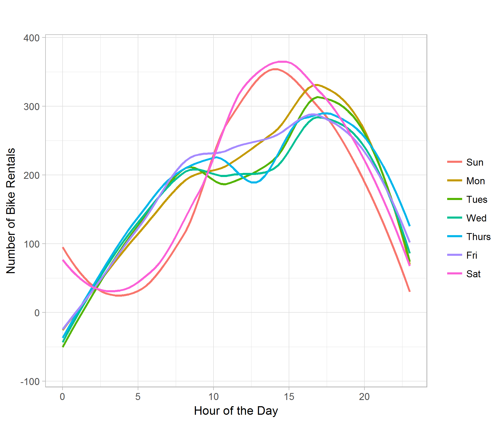

Making a boxplot comparing holiday effects shows that the average amounts of rental are about the same regardless of being a holiday or not. Due to having a smaller sample size for holidays, the range of rental count is generally smaller than that of non-holidays. We can also see similar seasonality to the season v.s. rental count boxplot; Winter shows the lowest in rental count and Summer shows the highest. **(Figure 04)**

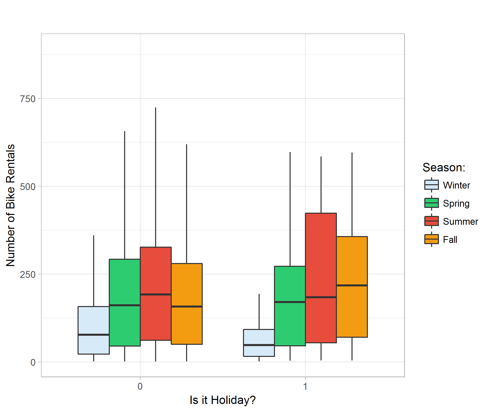

Plotting different type of weather against bike rental count indicates that the demand of bike rental is about the same in clear, cloudy or misty hours, with better overall count in better weather. Rainy and snowy days show significantly lower average rental count. I believe our dataset do not contain observations in really bad weathers so the boxplot for weather type 4 is a placeholder and do not have significant meaning. **(Figure 05)**


I also plot temperature, humidity, and wind speed against bike rental count categorized by different weather types. 

The temperature plot shows that generally, the warmer the temperature, the higher bike rental demand. However, in clear, cloudy, light rain or snow days, the rental count peaks at around 32 degrees Celsius; where as misty days, the rental demand peaks higher around 36 degrees Celsius. **(Figure 06)**


The humidity plot shows that generally, the higher the relative humidity, the lower bike rental demand. Although the curve for light rain or snow shows concavity, it is due to the smoothing of the data point by the ggplot function in R. **(Figure 07)**


The wind speed plot shows that although people enjoy gentle breeze in good weathers, the bike rental demand is significantly lower no matter the wind speed in light rain or snow weathers. **(Figure 08)**

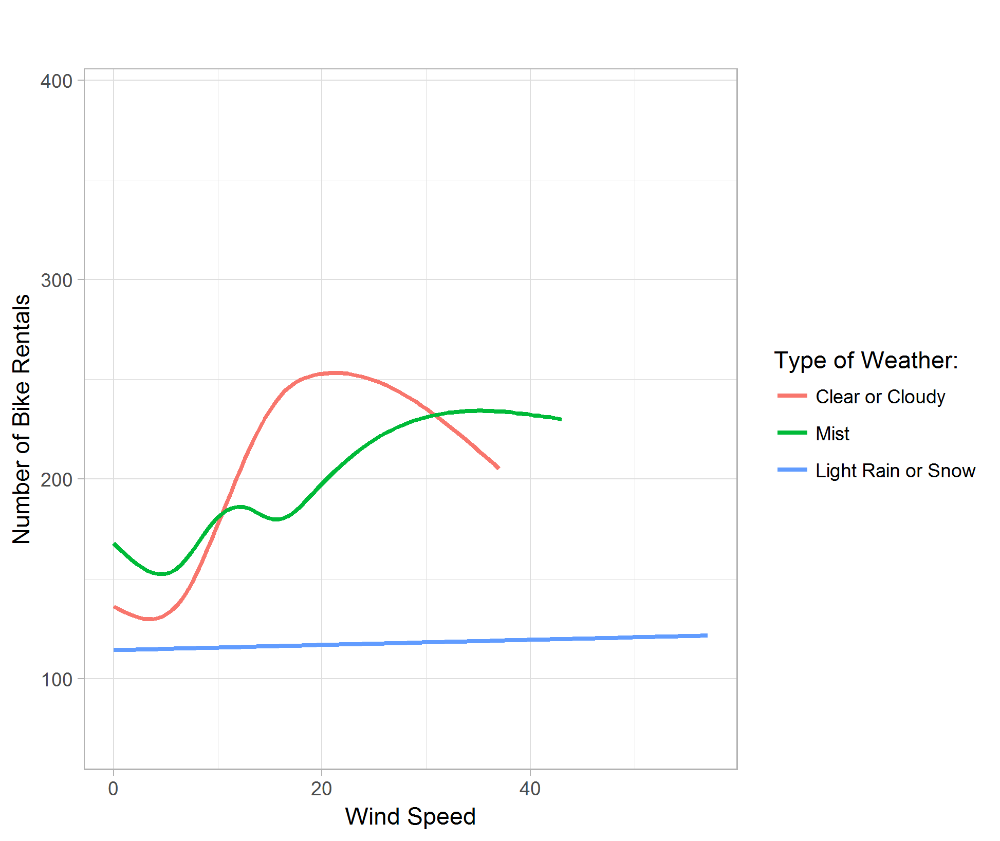

From the previous plots, observe that there might be high correlations between different variables, namely, season and month, season and weather type, etc.. 

##### 3.2 Correlation

By preparing a correlation matrix, we can have a more straight forward view of what variables are strongly correlated and what is weakly correlated. **(Figure 09)**


We can clearly see from the matrix that hour and temperature has the strongest correlation to bike rental count while all variables considered. However, hour and temperature has a relatively high correlation between each other. We can disregard the significantly high correlation between season and month since it is only natural for them to have high correlation.

##### 3.3 Kernel Regression

Kernel regression is a great way to find out non-linear relationships between variables; bootstrapping and calculating confidence intervals are also great ways to give insight to how confident are our non-linear estimations. Before actually building any models that assembles all the predictor variables, I would like to see the relationship of the strongest predictor variable against the response variable "count." 

Using C, I am able to build a function that efficiently calculate kernel regression with the input of a predictor and a response. The kernel regression utilizes a Gaussian kernel, and bandwidth chose by the rule of thumb proposed by Scott, D. W., providing a smooth estimation. 

The kernel regression plot of hour of the day against bike rental count **(Figure 10)** shows relatively higher rental count around 8 A.M. and 4 to 5 P.M. which correspond to the time people get to work and get off work. We also see a slightly higher count around 12 to 1 P.M. at noon, which corresponds to the time people having lunch break.

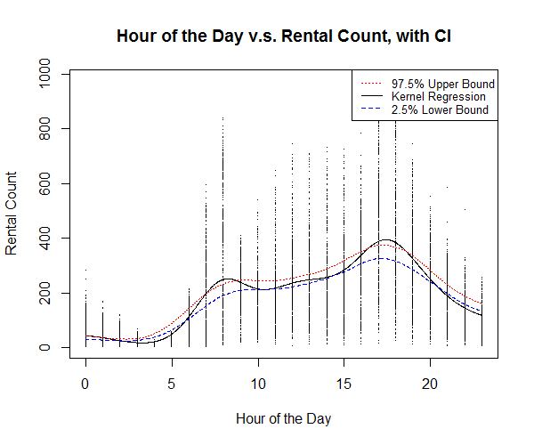

The kernel regression plot of temperature against bike rental count **(Figure 11)** shows a relatively higher rental count at around 34 degrees Celsius, however, most number of counts occurs around 18 to 33 degrees Celsius, which is understandably a more comfortable range of temperature.

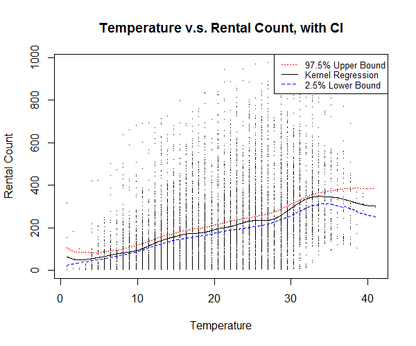

##### 3.4 Conclusions on Exploratory Data Analysis

From the initial data exploration, we can clearly see that hour of the day and temperature are the strongest factors that determines the bike share rental demand. 


#### 4 Model Building 

##### 4.1 Data Preparation

Before diving into building statistical models, I partition my dataset into two sets, training and testing. Training set will be used to train statistical models and estimate coefficients, while testing set will be used to validate the model we build with the training set. 75% of the complete data is partitioned into training set, sampled uniformly without replacement, and 25% is partitioned in to testing set. Sampling without replacement enables the model we build to extrapolate on the testing data, giving us a better sense of how our statistical models perform. 

The resulting training set contains 7179 observations and testing set contains 2394 observations.

##### 4.3 Linear Regression Model

I start out by building a simple linear model, pitting all the numerical variables against the response, that is, discarding the Boolean expression of weekday and holiday from the model. Removing insignificant predictor variables using the `step()` function, the resulting simple linear regression model has month, hour, temperature and humidity as its predictor variable. The simple linear regression model only achieved 0.3389 adjusted R-squared, which indicate a weak fit. This is ok since I only included this simple linear model to see how much variation in the response can numerical variables explain. And it turns out not much. **(Figure 12)**

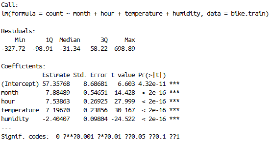

##### 4.4 Generalized Linear Model

Next, I construct a generalized linear model and try to include all the predictor variables into consideration. I transformed season, month, day of the week, and hour of the day into factors because these variables are only going to be integers and they are only going to be these values. Categorizing these values into factors will provide high accuracy in model building. After removing insignificant predictor variables from the model the generalized linear model achieved an R-squared of 0.6425. This is considered as a relatively good fit. **(Figure 13)**

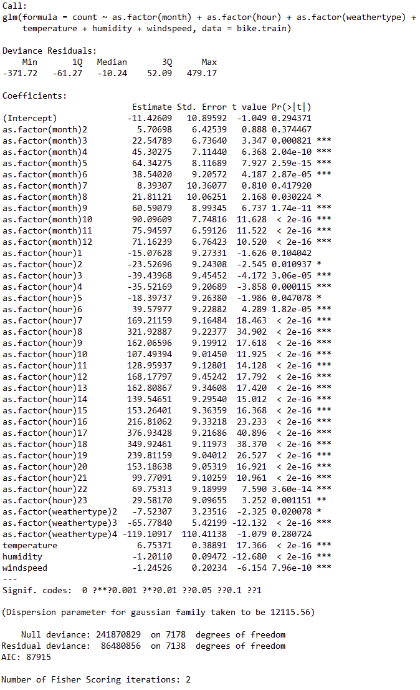

##### 4.5 Generalized Addictive Model

Generalized addictive model is a great method that it not only incorporates and smooth's parametric variables but also provide potentially better fit by inferring categorical variables with smooth functions. 

I begin experimenting with generalized addictive model by first fitting the response variable "count" against all predictor variables, treating date time variables as categories. After removing insignificant predictor variables, the GAM yields an R-squared of 0.6429, which is only slightly better than generalized linear model. **(Figure 14)**

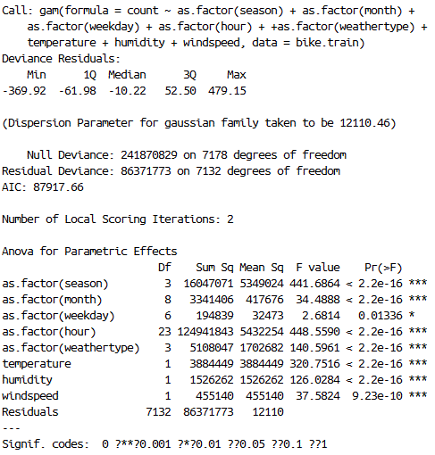

I then try and add spline smooth functions on the three weather variables, namely "temperature", "humidity" and "wind speed." After removing insignificant predictor variables, the new GAM yields an R-squared of 0.6491, which is slightly better than previous GAM. **(Figure 15)**

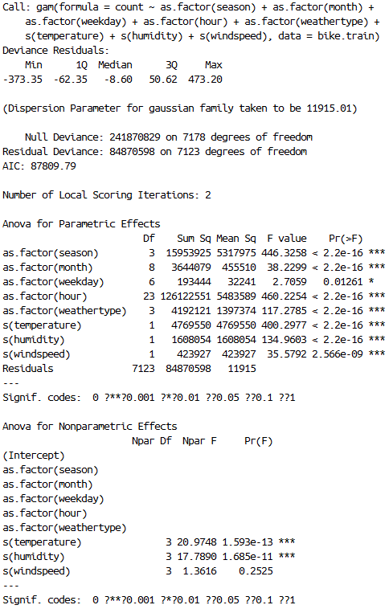

Furthermore, on top of the spline smoothing function, I then add different smoothing degrees of freedom for "temperature", "humidity" and "wind speed." I would like to split the range of each of these variable's range into segments of 10, forcing the spline smoothing function to calculate piecewise smoothing, allowing the smoothing to better fit the data. The resulting GAM has an R-squared of 0.6505. **(Figure 16)**

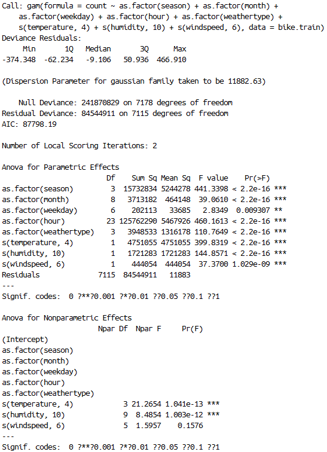

We can obviously go further by spline smoothing these variables using pieces of range 1, but I would like to jump to prediction with what I have now.

#### 5 Prediction

##### 4.1 Linear Model

Predicting using the attributes from testing dataset and plot them against the true values **(Figure 17)** shows that the simple linear model is limited and cannot explain most of the variation in the response variable. 

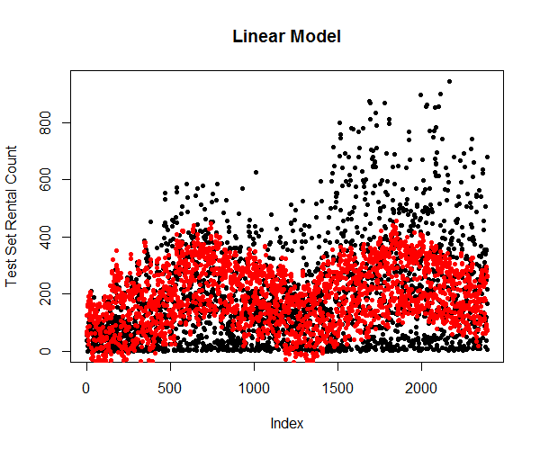

##### 4.2 Generalized Linear Model

Predicting using the attributes from testing dataset and plot them against the true values **(Figure 18)** shows that the generalized linear model is significantly more accurate in predicting the variations in the response variable.

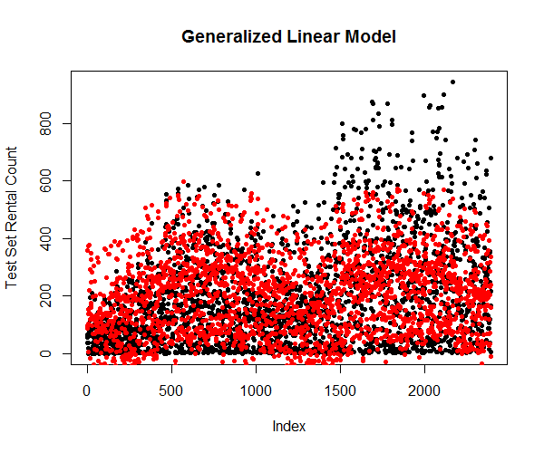

##### 4.3 Generalized Addictive Model

Here, I only used the third generalized addictive model in predicting. The plot **(Figure 19)** shows that the spread of the response variables is similar to generalized linear model. This is understandable since the goodness of fit only improved by about 1%.

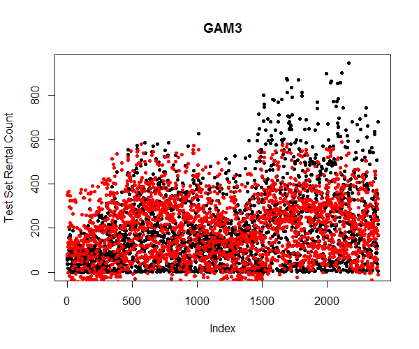

It is important to note that none of the statistical models has predicted the trend of the bike sharing rental count. This is due to the fact that the dataset does not contain relative predictor variables that can explain the seasonality, plus, I cannot simply transform the dataset and remove the trend without proper information allowing me to.


#### 6 Conclusion

Through exploratory analysis on the data about bike sharing rental counts, we discovered that hour of the day and temperature are the two most important factors that drives the demand of bike sharing rental. Using simple linear regression model, generalized linear model, and generalized addictive model, we successfully predict the bike sharing rental count with relatively high accuracy. 

There are many other predictive modelling methods I can employ, like time series etc. I can even use more advance data science tools like xgboost to build better models in predicting the bike sharing rental count. Due to the time limit of this course project, I only utilized the methods I have learned this quarter. Given enough time and resource, I may be able to construct better statistical models which more accurately explains the variations caused by different variables.


#### Appendices

##### Code

R Code:

```R
### loading library ###
library(ggplot2)
library(plyr)
library(gam)
library(reshape)

### loading data ###
bike <- read.csv("./data/train.csv")
month <- as.integer(format(as.POSIXlt(bike.new$datetime), format = "%m"))
weekday <- as.integer(format(as.POSIXlt(bike.new$datetime), format = "%u"))
hour <- as.integer(format(as.POSIXlt(bike.new$datetime), format = "%H"))
bike <- data.frame(bike$season, month, weekday, hour, as.factor(bike$workingday), as.factor(bike$holiday), 
                   as.factor(bike$weather), bike$temp, bike$hum, bike$windspeed, bike$count)
names(bike) <- c("season", "month", "weekday", "hour", "isweekday", 
                 "isholiday", "weathertype", "temperature", "humidity", "windspeed", "count")

bike <- bike[which(bike$windspeed != 0.0000),]
head(bike, 5)
count.summary <- ddply(bike,.(season, month, weekday, hour, isweekday, isholiday, weathertype), summarise, 
                       temperature = mean(temperature), 
                       humidity = mean(humidity), 
                       windspeed = mean(windspeed), 
                       count = mean(count))
head(count.summary)

### assesments ###

# boxplot of rental v.s. season 
ggplot(count.summary, aes(x = season, y = count, fill = factor(season))) +
  geom_boxplot(outlier.color = adjustcolor("black", alpha.f = 0), na.rm = TRUE) +
  ylab("Number of Bike Rentals") +
  ggtitle("\n") +
  scale_fill_manual(values = c("#D6EAF8", "#2ECC71", "#E74C3C", "#F39C12"), 
                    name="Season:",
                    breaks=c(1, 2, 3, 4),
                    labels=c("Winter", "Spring", "Summer", "Fall"))

# line plot of rentals v.s. hour of day
ggplot(count.summary, aes(x = hour, y = count, color = as.factor(weekday))) +
  geom_smooth(method = "loess", fill = NA, size = 1) +
  theme_light(base_size = 11) +
  xlab("Hour of the Day") +
  ylab("Number of Bike Rentals") +
  ggtitle("\n") +
  scale_color_discrete("") +
  theme(plot.title = element_text(size = 11, face="bold"))


# boxplot of rental v.s. holiday 
ggplot(count.summary, aes(x = isholiday, y = count, fill = factor(season))) +
  geom_boxplot(outlier.color = adjustcolor("black", alpha.f = 0), na.rm = TRUE) +
  theme_light(base_size = 11) +
  xlab("Is it Holiday?") +
  ylab("Number of Bike Rentals") +
  ggtitle("\n") +
  scale_fill_manual(values=c("#D6EAF8", "#2ECC71", "#E74C3C", "#F39C12"), 
                    name="Season:",
                    breaks=c(1, 2, 3, 4),
                    labels=c("Winter", "Spring", "Summer", "Fall")) +
  theme(plot.title = element_text(size = 11, face="bold"))

# boxplot of rentals v.s. weather
ggplot(count.summary, aes(x = weathertype, y = count, fill = weathertype)) +
  geom_boxplot(outlier.color = adjustcolor("black", alpha.f = 0), na.rm = TRUE) +
  theme_light(base_size = 11) +
  xlab("Type of Weather") +
  ylab("Number of Bike Rentals") +
  ggtitle("\n") +
  scale_fill_manual(values = c("#E74C3C", "#58D68D", "#5DADE2", "#F4D03F"), 
                    name = "Type of Weather:",
                    breaks = c(1, 2, 3, 4),
                    labels = c("\n Clear or Cloudy \n", 
                             "\n Mist \n", 
                             "\n Light Rain \n or Light Snow \n", 
                             "\n BAD WEATHER \n")) +
  theme(plot.title = element_text(size = 11, face="bold"))

# line plot of rental v.s. temperature
ggplot(count.summary, aes(x = temperature, y = count, color = weathertype)) +
  geom_smooth(fill = NA, size = 1) +
  theme_light(base_size = 11) +
  xlab("Temperature") +
  ylab("Number of Bike Rentals") +
  ggtitle("\n") +
  scale_color_discrete(name = "Type of Weather:",
                       breaks = c(1, 2, 3, 4),
                       labels = c("Clear or Cloudy", 
                                  "Mist", 
                                  "Light Rain or Snow", 
                                  "")) +
  theme(plot.title = element_text(size = 11, face="bold"))

# line plot of rental v.s. humidity
ggplot(count.summary, aes(x = humidity, y = count, color = weathertype)) +
  geom_smooth(method = 'loess', fill = NA, size = 1) +
  theme_light(base_size = 11) +
  xlab("Humidity") +
  ylab("Number of Bike Rentals") +
  ggtitle("\n") +
  scale_color_discrete(name = "Type of Weather:",
                       breaks = c(1, 2, 3, 4),
                       labels = c("Clear or Cloudy", 
                                  "Mist", 
                                  "Light Rain or Snow", 
                                  "")) +
  theme(plot.title = element_text(size = 11, face="bold"))

# line plot of rental v.s. wind speed
ggplot(count.summary, aes(x = windspeed, y = count, color = weathertype)) +
  geom_smooth(fill = NA, size = 1) +
  theme_light(base_size = 11) +
  xlab("Wind Speed") +
  ylab("Number of Bike Rentals") +
  ggtitle("\n") +
  scale_color_discrete(name = "Type of Weather:",
                       breaks = c(1, 2, 3, 4),
                       labels = c("Clear or Cloudy", 
                                  "Mist", 
                                  "Light Rain or Snow", 
                                  "")) +
  theme(plot.title = element_text(size = 11, face="bold"))

# correlation plot
bike.select <- data.frame(bike$season, bike$month, bike$weekday, bike$hour, as.integer(bike$isweekday),
                          as.integer(bike$isholiday), as.integer(bike$weather), bike$temperature,
                          bike$humidity, bike$windspeed, bike$count)
names(bike.select) <- c("season", "month", "weekday", "hour", "isweekday", 
                        "isholiday", "weathertype", "temperature", "humidity",
                        "windspeed", "count")

red=rgb(1,0,0); green=rgb(0,1,0); blue=rgb(0,0,1); white=rgb(1,1,1)
RtoWrange<-colorRampPalette(c(white, red ))
WtoGrange<-colorRampPalette(c(green, white)) 

ggsave("00_correlation_matrix.png", 
ggplot(melt(cor(bike.select)), aes(x = X1, y = X2, fill = value)) +
  geom_tile() +
  scale_fill_gradient2("", low = WtoGrange(100), mid = RtoWrange(100), high = "gray") +
  geom_text(aes(label = round(value, 2))) +
  coord_flip() + 
  ggtitle("\n Correlation Matrix \n") +
  theme(plot.title = element_text(size = 16, face = "bold"),
        axis.text.x = element_text(angle = 45, vjust = 0.6),
        axis.ticks.y = element_blank()) +
  xlab("") + ylab(""))

### Kernel Regression ###

dyn.load("nwkre.dll")

# hour
x <- as.double(bike$hour)
y <- as.double(bike$count)
b <- as.double(bw.nrd(x))
g <- as.double(seq(min(x),max(x), length = 1000))
m <- as.integer(length(g))
n <- as.integer(length(x))
hour.density <- .C("nwkre", m, n, x, y, b, g, ans = double(m))

mat <- matrix(0, nrow = 200, ncol = 1000)
dat <- cbind(x,y)

for (i in 1:200){
  sample = dat[sample(nrow(dat), 1000, replace = TRUE),]
  m.sample = as.integer(1000)
  n.sample = as.integer(1000)
  b.sample = as.double(bw.nrd(sample[,1]))
  density = .C("nwkre", 
               m, n.sample, as.double(sample[,1]), as.double(sample[,2]), b.sample, g, res = double(m))
  mat[i,] = density$res
}

mat2 <- matrix(0, nrow = 2, ncol = 1000)
for (i in 1:1000){
  mat2[1,i] = quantile(mat[,i], 0.025)
  mat2[2,i] = quantile(mat[,i], 0.975)
}
plot(c(min(x), max(x)), c(min(y), max(y)),type = "n", 
     main = "Hour of the Day v.s. Rental Count, with CI", 
     xlab = "Hour of the Day", 
     ylab = "Rental Count")
points(x,y, pch = ".")
lines(g, hour.density$ans)
lines(g, mat2[1,], lty = 2, col = "blue")
lines(g, mat2[2,], lty = 3, col = "red")
legend("topright", c("97.5% Upper Bound","Kernel Regression","2.5% Lower Bound"), 
       lty=c(3,1,2), cex=.8, col=c("red","black","blue"))

# temperature
x <- as.double(bike$temperature)
y <- as.double(bike$count)
b <- as.double(bw.nrd(x))
g <- as.double(seq(min(x),max(x), length = 1000))
m <- as.integer(length(g))
n <- as.integer(length(x))
temperature.density <- .C("nwkre_ep", m, n, x, y, b, g, ans = double(m))

mat <- matrix(0, nrow = 200, ncol = 1000)
dat <- cbind(x,y)

for (i in 1:200){
  sample = dat[sample(nrow(dat), 1000, replace = TRUE),]
  m.sample = as.integer(1000)
  n.sample = as.integer(1000)
  b.sample = as.double(bw.nrd(sample[,1]))
  density = .C("nwkre", 
               m, n.sample, as.double(sample[,1]), as.double(sample[,2]), b.sample, g, res = double(m))
  mat[i,] = density$res
}

mat2 <- matrix(0, nrow = 2, ncol = 1000)
for (i in 1:1000){
  mat2[1,i] = quantile(mat[,i], 0.025)
  mat2[2,i] = quantile(mat[,i], 0.975)
}
plot(c(min(x), max(x)), c(min(y), max(y)),type = "n", 
     main = "Temperature v.s. Rental Count, with CI", 
     xlab = "Temperature", 
     ylab = "Rental Count")
points(x,y, pch = ".")
lines(g, temperature.density$ans)
lines(g, mat2[1,], lty = 2, col = "blue")
lines(g, mat2[2,], lty = 3, col = "red")
legend("topright", c("97.5% Upper Bound","Kernel Regression","2.5% Lower Bound"), 
       lty=c(3,1,2), cex=.8, col=c("red","black","blue"))

# humidity
x <- as.double(bike$humidity)
y <- as.double(bike$count)
b <- as.double(bw.nrd(x))
g <- as.double(seq(min(x),max(x), length = 1000))
m <- as.integer(length(g))
n <- as.integer(length(x))
humidity.density <- .C("nwkre", m, n, x, y, b, g, ans = double(m))

mat <- matrix(0, nrow = 200, ncol = 1000)
dat <- cbind(x,y)

for (i in 1:200){
  sample = dat[sample(nrow(dat), 1000, replace = TRUE),]
  m.sample = as.integer(1000)
  n.sample = as.integer(1000)
  b.sample = as.double(bw.nrd(sample[,1]))
  density = .C("nwkre", 
               m, n.sample, as.double(sample[,1]), as.double(sample[,2]), b.sample, g, res = double(m))
  mat[i,] = density$res
}

mat2 <- matrix(0, nrow = 2, ncol = 1000)
for (i in 1:1000){
  mat2[1,i] = quantile(mat[,i], 0.025)
  mat2[2,i] = quantile(mat[,i], 0.975)
}
plot(c(min(x), max(x)), c(min(y), max(y)),type = "n", 
     main = "Humidity v.s. Rental Count, with CI", 
     xlab = "Humidity", 
     ylab = "Rental Count")
points(x,y, pch = ".")
lines(g, humidity.density$ans)
lines(g, mat2[1,], lty = 2, col = "blue")
lines(g, mat2[2,], lty = 3, col = "red")
legend("topright", c("97.5% Upper Bound","Kernel Regression","2.5% Lower Bound"), 
       lty=c(3,1,2), cex=.8, col=c("red","black","blue"))

# windspeed
x <- as.double(bike$windspeed)
y <- as.double(bike$count)
b <- as.double(bw.nrd(x))
g <- as.double(seq(min(x),max(x), length = 1000))
m <- as.integer(length(g))
n <- as.integer(length(x))
windspeed.density <- .C("nwkre", m, n, x, y, b, g, ans = double(m))

mat <- matrix(0, nrow = 200, ncol = 1000)
dat <- cbind(x,y)

for (i in 1:200){
  sample = dat[sample(nrow(dat), 1000, replace = TRUE),]
  m.sample = as.integer(1000)
  n.sample = as.integer(1000)
  b.sample = as.double(bw.nrd(sample[,1]))
  density = .C("nwkre", 
               m, n.sample, as.double(sample[,1]), as.double(sample[,2]), b.sample, g, res = double(m))
  mat[i,] = density$res
}

mat2 <- matrix(0, nrow = 2, ncol = 1000)
for (i in 1:1000){
  mat2[1,i] = quantile(mat[,i], 0.025)
  mat2[2,i] = quantile(mat[,i], 0.975)
}
plot(c(min(x), max(x)), c(min(y), max(y)),type = "n", 
     main = "Wind Speed v.s. Rental Count, with CI", 
     xlab = "Wind Speed", 
     ylab = "Rental Count")
points(x,y, pch = ".")
lines(g, windspeed.density$ans)
lines(g, mat2[1,], lty = 2, col = "blue")
lines(g, mat2[2,], lty = 3, col = "red")
legend("topright", c("97.5% Upper Bound","Kernel Regression","2.5% Lower Bound"), 
       lty=c(3,1,2), cex=.8, col=c("red","black","blue"))

dyn.unload("nwkre.dll")

### building models ###
# partitioning data
set.seed(1)
sample.index <- sample(nrow(bike), 9573*0.75, replace = FALSE)
bike.train <- bike[sample.index,]
bike.test <- bike[-sample.index,]

# linear regression
bike.lm <- lm(data = bike.train, count ~ season + month + weekday + hour + temperature + humidity + windspeed)
summary(bike.lm)
bike.lm.step <- step(bike.lm)
summary(bike.lm.step)

# generalized linear model
bike.glm2 <- glm(data = bike.train, count ~ as.factor(season) + as.factor(month) + as.factor(weekday) + as.factor(hour) + as.factor(isweekday) + 
                   as.factor(isholiday) + as.factor(weathertype) + temperature + humidity + windspeed)
summary(bike.glm2)
bike.glm2.step <- step(bike.glm2)
summary(bike.glm2.step)
1 - (86480856/241870829)

# gam1
bike.gam1 <- gam(data = bike.train, count ~ as.factor(season) + as.factor(month) + as.factor(weekday) + as.factor(hour) + as.factor(isweekday) + 
                   as.factor(isholiday) + as.factor(weathertype) + temperature + humidity + windspeed)
summary(bike.gam1)
1 - (86367987/241870829)
bike.gam1.step <- gam(data = bike.train, count ~ as.factor(season) + as.factor(month) + as.factor(weekday) + as.factor(hour) + 
                        + as.factor(weathertype) + temperature + humidity + windspeed)
summary(bike.gam1.step)
1 - (86371773/241870829)

# gam2
bike.gam2 <- gam(data = bike.train, count ~ as.factor(season) + as.factor(month) + as.factor(weekday) + as.factor(hour) + as.factor(isweekday) + 
                   as.factor(isholiday) + as.factor(weathertype) + s(temperature) + s(humidity) + s(windspeed))
summary(bike.gam2)
1 - (84860137/241870829)
bike.gam2.step <- gam(data = bike.train, count ~ as.factor(season) + as.factor(month) + as.factor(weekday) + as.factor(hour) + as.factor(weathertype) + 
                        s(temperature) + s(humidity) + s(windspeed))
summary(bike.gam2.step)
1 - (84870598/241870829)

# gam3
bike.gam3 <- gam(data = bike.train, count ~ as.factor(season) + as.factor(month) + as.factor(weekday) + as.factor(hour) + as.factor(isweekday) + 
                   as.factor(isholiday) + as.factor(weathertype) + s(temperature, 4) + s(humidity, 10) + s(windspeed, 6))
summary(bike.gam3)
1 - (84534154/241870829)
bike.gam3.step <- gam(data = bike.train, count ~ as.factor(season) + as.factor(month) + as.factor(weekday) + as.factor(hour) + as.factor(weathertype) + 
                        s(temperature, 4) + s(humidity, 10) + s(windspeed, 6))
summary(bike.gam3.step)
1 - (84544911/241870829)

anova(bike.gam1.step, bike.gam2.step, bike.gam3.step, test = "F")

### predictions ###
# lm
plot(bike.test$count, main = "Linear Model", ylab = "Test Set Rental Count", pch = 20)
points(predict(bike.lm.step, newdata = bike.test), col = "red", pch = 20)

# glm
plot(bike.test$count, main = "Generalized Linear Model", ylab = "Test Set Rental Count", pch = 20)
points(predict(bike.glm2.step, newdata = bike.test), col = "red", pch = 20)

# gam3
plot(bike.test$count, main = "GAM3", ylab = "Test Set Rental Count", pch = 20)
points(predict(bike.gam3.step, newdata = bike.test), col = "red", pch = 20)
```

C Code:

```C
#include <R.h>
#include <Rmath.h>

void nwkre (int *m, int *n, double *x, double *y, double *b, double *g, double *res)
{
	for(int i = 0; i < *m; i++)
    {
		double sum1 = 0.0;
		double sum2 = 0.0;
		for(int j = 0; j < *n; j++)
        {
			double temp = dnorm((x[j] - g[i])/ *b, 0, 1, 0)/ *b;
			sum1 += y[j] * temp;
			sum2 += temp;
		}
		if(sum2 > 0.0) res[i] = sum1 / sum2;
		else res[i] = 0.0;
	}
}
```
